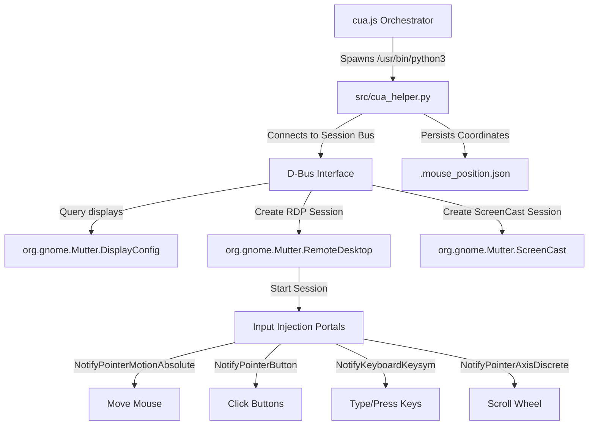

<p align="center">
  
</p>

<h1 align="center">Swades Agent</h1>

<p align="center">
  Autonomous AI software engineering agent for your terminal.<br/>
  ReAct loop · OpenAI-compatible · Token streaming · Self-correcting · 24/7 Director mode
</p>

<p align="center">
  <a href="#setup--installation">Setup</a> ·
  <a href="#how-to-run">How to Run</a> ·
  <a href="#tools">Tools</a> ·
  <a href="#architecture">Architecture</a> ·
  <a href="#safety--guardrails">Safety</a>
</p>

---

## What is Swades Agent?

Swades Agent is an open-source, terminal-native autonomous AI coding agent built on the **ReAct (Reasoning + Acting)** loop pattern. You give it a coding task in plain text. It reads your codebase, edits files with surgical precision, runs shell commands, searches code, and iterates until the task is done — all without leaving your terminal.

It works with any **OpenAI-compatible API** (OpenAI, OpenRouter, Groq, Ollama, etc.), streams tokens to the terminal in real-time as the model thinks, and runs automatic syntax validation on every file it writes.

No GUI. No cloud lock-in. No build step. ~800 lines of plain Node.js.

---

## Key Capabilities

- **ReAct agentic loop** — Thought → Tool Call → Observation → repeat until task is solved
- **Real-time token streaming** — see the model's reasoning and tool arguments token-by-token as they arrive
- **Partial file patching** — edits only the exact block that needs changing, not the entire file (saves tokens, preserves indentation)
- **Automatic codebase indexing** — maps your repo structure (imports, exports, classes, functions) before starting, so the model never re-scans blindly
- **Built-in syntax checker** — validates bracket matching, indentation consistency, and runs `node --check` on every JS save
- **24/7 Director mode** — a second "Director" model instance reviews progress after each run and writes the next subtask on behalf of the user, iterating autonomously
- **Session memory** — persists a summary of each run to `.agent_memory.json` and injects recent context into the next session
- **Workspace isolation** — when installed inside a project subdirectory, the agent hides its own files from the model so it only sees your code

---

## Setup & Installation

### Step 1: Install Node.js

You need **Node.js v18 or later** (v22 recommended).

```bash
node -v
```

If not installed, download from [nodejs.org](https://nodejs.org/) or use a version manager like [nvm](https://github.com/nvm-sh/nvm).

### Step 2: Clone & Install Dependencies

```bash
git clone https://github.com/Electroiscoding/Swades-Agent.git
cd Swades-Agent
npm install
```

This installs three packages: `openai` (API client), `dotenv` (env loading), and `chalk` (terminal colors).

### Updating Existing Clones (from old repository name)

If you previously cloned the repository under its old name (`reactsystemlearning1`), you can update your local copy to point to the new URL and pull the latest features (including streaming fixes and branding) with:

```bash
# 1. Update the remote URL to the new name
git remote set-url origin https://github.com/Electroiscoding/Swades-Agent.git

# 2. Pull the latest code from the main branch
git pull origin main

# 3. Update dependencies
npm install
```

### Step 3: Configure your Environment

**Mac / Linux:**
```bash
cp .env.example .env
```

**Windows:**
```cmd
copy .env.example .env
```

Open `.env` and fill in your values:

```env
API_KEY=sk-or-v1-your-key-here
BASE_URL=https://openrouter.ai/api/v1
MODEL=openrouter/free
```

**All supported environment variables:**

| Variable | Required | Default | Description |
|---|---|---|---|
| `API_KEY` | Yes | — | Your LLM provider API key |
| `BASE_URL` | No | `https://openrouter.ai/api/v1` | Provider base URL (change for OpenAI, Groq, Ollama, etc.) |
| `MODEL` | No | `openrouter/free` | Model identifier string |
| `MAX_STEPS` | No | `30` | Max tool-call iterations per agent run before hard stop |
| `MAX_OUTPUT_LENGTH` | No | `10000` | Character cap on tool output returned to the model |
| `WORKDIR` | No | `process.cwd()` | Absolute or relative path the agent operates on |

**Using a different provider:**

```env
# OpenAI
API_KEY=sk-...
BASE_URL=https://api.openai.com/v1
MODEL=gpt-4o

# Groq
API_KEY=gsk_...
BASE_URL=https://api.groq.com/openai/v1
MODEL=llama-3.3-70b-versatile

# Local Ollama
API_KEY=ollama
BASE_URL=http://localhost:11434/v1
MODEL=qwen2.5-coder:7b
```

**Important — running inside another project:**

If you clone this repo as a subfolder inside your own codebase (e.g. `myproject/swades-agent/`), add this to `.env` so the agent targets your project root and not its own folder:

```env
WORKDIR=../
```

---

## How to Run

### Standard Mode (single task, one run)

The agent executes the task from start to finish in a single session and exits when done.

**Interactive prompt:**
```bash
npm start
# Answer the task question, then answer N to the autonomous mode question
```

**Direct task via argument:**
```bash
node src/index.js "Write a hello world script in Python"
node src/index.js "Add input validation to the login form in src/auth.js"
node src/index.js "Find all TODO comments in the codebase and open a summary file"
```

### 24/7 Autonomous Mode (Director-supervised, multi-cycle)

In autonomous mode, a second "Director" model instance supervises the worker. After each worker run, the Director reviews the full conversation history and writes the next subtask prompt on behalf of the user. This repeats until the Director determines the goal is fully achieved.

**Interactive prompt:**
```bash
npm start
# Answer the task question, then answer Y to the autonomous mode question
```

**Direct task via argument:**
```bash
node src/index.js "Create a fully functional REST API with tests, run them, and fix any failures" --autonomous
node src/index.js "Refactor the entire codebase to TypeScript and verify it compiles" --autonomous
```

The `--autonomous` flag (or `-a`) activates the Director loop. The Director runs for up to 5 cycles by default.

---

## Tools

The agent has access to 7 tools it can call during a run:

| Tool | Arguments | Description |
|---|---|---|
| `index_codebase` | _(none)_ | Scans workspace, writes `.agent_index.json` with file paths, sizes, imports, exports, classes, functions |
| `read_file` | `path`, `start_line?`, `end_line?` | Returns file contents with line numbers. Supports partial reads by line range. |
| `write_file` | `path`, `content` | Writes a complete new file. Runs syntax + indentation checks on save. |
| `patch_file` | `path`, `target`, `replacement` | Replaces a unique block within an existing file. Space-sensitive. Fails with a clear error if target is ambiguous or not found. |
| `list_dir` | `path`, `recursive?` | Lists directory tree. Skips `node_modules`, `.git`, and the agent's own folder. |
| `grep_search` | `pattern`, `path`, `include?` | Runs `grep -rnI` across the workspace. Excludes the agent directory automatically. |
| `run_command` | `command`, `cwd?` | Executes a shell command with 30s timeout. Prompts for user confirmation on destructive patterns. |

**Automatic validation on every write:**

Both `write_file` and `patch_file` run these checks immediately after writing and return the results to the model so it can self-correct:

- Bracket matching: detects unclosed `{`, `(`, `[` and mismatched pairs
- Indentation consistency: flags mixed tabs + spaces; flags sudden indentation jumps
- JS/MJS/CJS: runs `node --check <file>` for compiler-level syntax errors
- JSON: runs `JSON.parse()` on the written content

---

## CUA (Computer Use Agent) Mode & Wayland Native Support

Swades Agent features a graphical **Computer Use Agent (CUA)** mode, empowering the AI model to interact directly with your Linux desktop. Unlike most automation systems that fail under Wayland due to legacy X11 emulation tools (`xdotool`, `pyautogui`), Swades Agent supports native GUI automation on modern **GNOME Wayland** configurations.

---

### Detailed Wayland Native Architecture
Under Wayland, the graphical environment enforces security isolation, preventing direct hardware event simulation or global pointer querying. Swades Agent bypasses this restriction by using GNOME's native Mutter remote desktop infrastructure:



#### Key Architecture Components:
1. **Mutter D-Bus Session Linking**:
   - The helper script connects to the session bus via `gi.repository.Gio` and `GLib`.
   - It queries `org.gnome.Mutter.DisplayConfig` to find the connector name of the primary monitor dynamically (e.g. `eDP-1`, `HDMI-1`).
   - It initializes a RemoteDesktop session to get a unique `SessionId`.
   - It initializes a ScreenCast session, linking it to the RemoteDesktop session via the `remote-desktop-session-id` property.
   - It starts the ScreenCast recording on the primary monitor connector, which generates a PipeWire stream path.
   - It starts the RemoteDesktop session. With both sessions active, absolute pointer coordinates are injected relative to the screen dimensions.
2. **State-Based Mouse Tracking**:
   - Because Wayland blocks querying the active mouse coordinates directly, Swades Agent maintains an internal coordinate tracking state file in `.mouse_position.json`.
   - Every move, click, or drag updates this file.
   - When a screenshot is taken (using standard portal screencasting), `cua_helper.py` reads the last stored coordinate from `.mouse_position.json` to draw the red target crosshair overlay at the correct place.
3. **Graceful Fallback**:
   - If the script is run on an X11-based session, it automatically falls back to standard `xdotool` and `pyautogui` logic, making the agent compatible with both Wayland and X11 out-of-the-box.

---

### Step-by-Step Installation Prerequisites (Spoonfeeding)
To use CUA mode under a Wayland session, follow these steps to set up your environment:

#### Step 1: Ensure system python has GObject bindings
Since Node.js spawns the helper script using the system `/usr/bin/python3`, you must ensure that python has access to the GObject Introspection library.
Run the following command to install the required package on Debian/Ubuntu-based systems:
```bash
sudo apt update
sudo apt install python3-gi python3-gi-cairo
```
On Fedora/RHEL:
```bash
sudo dnf install python3-gobject
```
On Arch Linux:
```bash
sudo pacman -S python-gobject
```

#### Step 2: Enable Remote Desktop Sharing in GNOME
Make sure your user session is authorized to run Mutter Remote Desktop sessions. In GNOME, navigate to:
`Settings -> Sharing -> Remote Desktop` and ensure it is turned on.
*(Note: Since the agent connects locally via the active user D-Bus session, you do not need to configure any network/port forwarding rules).*

---

### How to Run CUA Mode

#### Method 1: Interactive Prompt (Recommended)
1. Start the agent:
   ```bash
   npm start
   ```
2. Enter your goal when prompted (e.g. `go to notepad and type hello world and save it`).
3. Under **Mode**, type `c` (or `cua`) and press Enter.

#### Method 2: Command Line Argument
Pass your prompt and add the `--cua` or `-c` flag:
```bash
node src/index.js "go to notepad and type hello world" --cua
```

---

### Advanced Click-Loop Safety Guardrail
To safeguard against models getting stuck in infinite loops (for example, clicking the same spot repeatedly on a frozen or unresponsive GUI element), Swades Agent implements a strict **repeat click prevention check** directly inside the orchestrator ([cua.js](file:///home/soham/reactsystemlearning1/src/cua.js)):

1. **Bounding Box Proximity**: Clicks are tracked by their coordinates. Any click that falls within a **25px horizontal and 15px vertical bounding box** of a previous click is classified as being in the "same area".
2. **Consecutive Block**: The model is forbidden from clicking the same area consecutively (back-to-back). If it attempts to do so:
   - The click is blocked.
   - The terminal displays a red warning: `❌ Declined: Cannot click in the same place consecutively (back-to-back).`
   - An error message is returned to the model as tool output: `Declined: You cannot click the same area consecutively...`
3. **Overall Frequency Limit**: The model is forbidden from clicking the same area more than **2 times overall** throughout the entire task execution. If a third click is attempted:
   - The click is blocked.
   - The terminal displays a red warning: `❌ Declined: Clicked this place more than twice overall.`
   - An error message is returned to the model as tool output: `Declined: You have already clicked this same area 2 times...`

This feedback forces the model to self-correct, try alternative UI pathways, or scroll/navigate elsewhere, breaking infinite loops and saving token costs.

---

## Architecture

```
src/
  index.js      CLI entry point — reads task from args or stdin, runs auto-index, dispatches to agent or director
  agent.js      ReAct loop — message history, streaming LLM call, tool dispatch, observation injection
  director.js   Director loop — runs worker across cycles, reviews history, writes next subtask prompt
  llm.js        OpenAI SDK wrapper — stream=true, reconstructs full message from SSE delta chunks
  tools.js      7 tool implementations + heuristic syntax checker + codebase indexer
  prompts.js    System prompt (JSONL-structured) + OpenAI function-calling tool schemas
  memory.js     Appends session summaries to .agent_memory.json, injects recent context at startup
```

**Single-run message flow:**
```
index.js → index_codebase() → agent.js loop:
  [system + memory + task] → LLM (streaming SSE)
    → text delta    → printed live to terminal
    → tool_call delta → executeTool() → observation → appended to messages
  repeat until LLM returns no tool calls → print final answer → exit
```

**24/7 autonomous message flow:**
```
director.js → cycle 1..N:
  runAgent(messages)         ← worker resolves a subtask
  callLLM(directorMessages)  ← director reviews history, writes next prompt
  messages.push(nextPrompt)  ← appended as user turn, fed into next cycle
  repeat until director outputs "STATUS: COMPLETE"
```

---

## Safety & Guardrails

- **Workspace isolation & self-hiding** — when installed as a subdirectory of the target project, the agent filters out its own folder from `list_dir` and `grep_search`. The model cannot see, read, or modify its own source files, which prevents it from getting confused about which codebase it is working on.
- **Dangerous command blocking** — shell commands matching `rm -rf`, `sudo`, `kill`, `dd if=`, `chmod 777`, `:(){`, and others pause execution and require an explicit `y` typed in the terminal before running.
- **Step cap** — the worker agent stops after `MAX_STEPS` iterations (default 30) to prevent infinite loops. This is configurable via `.env`.
- **Director cycle cap** — the Director loop stops after 5 cycles by default.
- **Timeout** — `run_command` automatically times out after 30 seconds.
- **Workspace scoping** — all file paths passed to tools are resolved relative to `WORKDIR`. The agent cannot access paths outside of it.

---

## Session Memory

After each completed run, the agent appends a session record to `.agent_memory.json`:

```json
{
  "timestamp": "2024-01-15T10:30:00Z",
  "task": "Add input validation to the login form",
  "summary": "Added email format check and password length validation in src/auth.js. Updated tests.",
  "toolsUsed": ["read_file", "patch_file", "run_command"]
}
```

On the next run, the three most recent sessions are injected into the system prompt, giving the agent continuity between invocations without needing a long-running server.

---

## What's New in v2.0 & v2.1

- **Native Wayland GUI Support (v2.1)** — native desktop input simulation (clicking, typing, scrolling, dragging) via GNOME Mutter RemoteDesktop and ScreenCast DBus APIs. No X11 dependencies.
- **Anti-Loop Click Protection (v2.1)** — automatic consecutive and overall frequency limits on spatial clicks (using a 25px x 15px bounding box) to prevent looping click sequences.
- **JSON System Instructions (v2.1)** — system prompt structured as a clean, high-compliance JSON schema to enforce reasoning/ReAct rules.
- **24/7 Director Loop (v2.0)** — autonomous multi-cycle execution with a supervising Director model. Pass `--autonomous` to any task.
- **Codebase Indexing (v2.0)** — automatic `index_codebase` run at startup generates `.agent_index.json` with the full repository structure so the model starts with deep context.
- **Partial File Patching (v2.0)** — `patch_file` tool for surgical block-level edits. Preserves exact indentation. Saves significant tokens vs. full-file rewrites.
- **Static Syntax Guardrails (v2.0)** — automatic bracket matching, indentation checks, `node --check`, and JSON parse validation on every file save, with errors returned to the model for self-correction.
- **Real-time Token Streaming (v2.0)** — LLM reasoning, tool names, and arguments stream to the terminal token-by-token using OpenAI SDK SSE.
- **Session Memory (v2.0)** — cross-run context via `.agent_memory.json`.
- **Referer attribution (v2.0)** — all API calls include `HTTP-Referer: https://xerv.netlify.app/swades.html` for OpenRouter analytics tracking.
