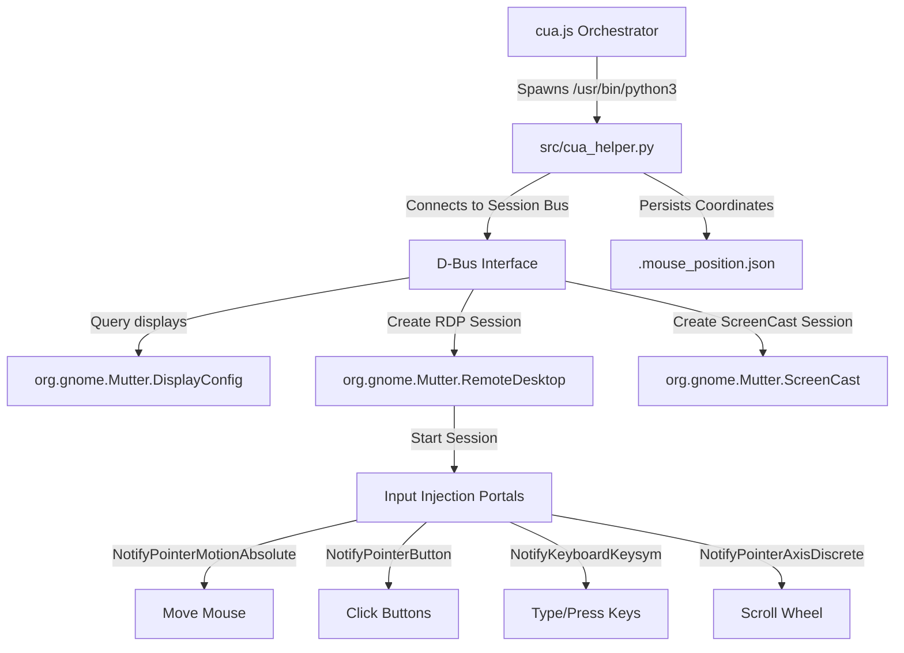

<p align="center">
  
</p>

<h1 align="center">Swades Agent v4.0</h1>

<p align="center">
  Autonomous AI software engineering agent for your terminal.<br/>
  Adaptive 1–25+ Agent Scaling · 9-Phase Orchestrator Loop · File Dependency DAG · Patch Safety & Auto-Rollback · Native Groq Support
</p>

<p align="center">
  <a href="https://www.npmjs.com/package/@xerv/swades-agent"></a>
  <a href="https://open-vsx.org/extension/xerv/swades-agent"></a>
  <a href="LICENSE"></a>
</p>

<p align="center">
  <a href="#-the-hook-how-to-100000000-overutilise-swades-in-30-seconds">The Hook</a> ·
  <a href="#install">Install</a> ·
  <a href="#how-to-use">How to Use</a> ·
  <a href="#key-capabilities">Capabilities</a> ·
  <a href="#tools">Tools</a> ·
  <a href="#architecture">Architecture</a> ·
  <a href="#safety--guardrails">Safety</a>
</p>

---

## What is Swades Agent?

Swades Agent is an open-source, terminal-native autonomous AI software engineer built on the **ReAct (Reasoning + Acting)** loop pattern. You give it a coding task in plain English. It parses your repository, plans architectural changes, constructs dependency graphs, spawns an adaptive fleet of specialized agents (from 1 to 25+), stages code patches, runs unit tests, and self-heals until the goal is fully accomplished — all without leaving your terminal.

It works natively with **Groq** (`llama-3.3-70b-versatile` at 300+ tok/s), **OpenRouter**, **OpenAI**, and **local Ollama**, streams tokens to your terminal in real-time, and automatically rolls back changes if tests or quality gates fail.

No GUI required. No cloud lock-in. No build step. **Zero configuration choices at runtime — describe what you need and watch it build.**

<details>
<summary><b>📊 Codebase Line Count Breakdown (v4.0 Architecture)</b></summary>

| File | Language | Lines of Code | Description |
| :--- | :--- | :---: | :--- |
| [`src/tools.js`](src/tools.js) | JavaScript | 1,357 | 15 tool implementations, syntax checker, stack detection, shell runner |
| [`src/cua_helper.py`](src/cua_helper.py) | Python | 768 | GNOME Mutter RDP/ScreenCast Wayland automation helper |
| [`src/cua.js`](src/cua.js) | JavaScript | 596 | Computer Use Agent desktop orchestrator |
| [`src/simulator.js`](src/simulator.js) | JavaScript | 537 | Multi-scenario sandbox simulation engine |
| [`src/agent.js`](src/agent.js) | JavaScript | 490 | Core ReAct agentic loop, loop detector, checkpoint stashing |
| [`src/prompts.js`](src/prompts.js) | JavaScript | 335 | System prompt, 10 specialized role prompts, tool schemas |
| [`src/index.js`](src/index.js) | JavaScript | 311 | CLI entry point, argument parser, persistent chat loop |
| [`src/subagent.js`](src/subagent.js) | JavaScript | 309 | Subagent worktree lifecycle, debate mode, dynamic semaphore queue |
| [`src/orchestratorLoop.js`](src/orchestratorLoop.js) | JavaScript | 306 | Core 9-phase orchestrator loop (Analyse → Plan → Approve → Assign → Monitor → Debate → Merge → Verify → Summarize) |
| [`src/patchSafety.js`](src/patchSafety.js) | JavaScript | 291 | Staged patches, risk scoring (0–100), diff review, auto-rollback on test failure |
| [`src/llm.js`](src/llm.js) | JavaScript | 273 | Multi-provider client (Groq, OpenRouter, OpenAI, Ollama), streaming, fallback cascade |
| [`src/memory.js`](src/memory.js) | JavaScript | 251 | 4-layer persistent memory (Project, Preferences, Tasks, Performance) |
| [`src/orchestrator.js`](src/orchestrator.js) | JavaScript | 223 | Adaptive 4-tier complexity classifier (Tiny, Normal, Big, Huge) & merge engine |
| [`src/dependencyGraph.js`](src/dependencyGraph.js) | JavaScript | 218 | File dependency DAG, Kahn's topological sort, conflict prediction, file locking |
| [`src/qualityGates.js`](src/qualityGates.js) | JavaScript | 140 | Automated quality gates (lint, typecheck, test, build, audit) |
| [`src/synthesis.js`](src/synthesis.js) | JavaScript | 152 | Post-task report generator (summary, risks, tests, next steps, telemetry) |
| [`src/take_portal_screenshot.py`](src/take_portal_screenshot.py) | Python | 111 | Pipewire video stream frame grabber |
| [`src/director.js`](src/director.js) | JavaScript | 109 | Autonomous Director supervisor loop |
| [`src/approvalFlow.js`](src/approvalFlow.js) | JavaScript | 104 | User approval flow (auto / critical / manual) |
| [`src/cleanup.js`](src/cleanup.js) | JavaScript | 103 | Cache directory hashing & worktree cleanup |

**Total: 7,000+ lines of production code.** Zero mocks. Zero placeholders.
</details>

---

## ⚡ The Hook: How to 100000000% Overutilise Swades in 30 Seconds

> *"The Hook Model (Nir Eyal): Trigger $\rightarrow$ Action $\rightarrow$ Variable Reward $\rightarrow$ Investment. Build the habit of 10x engineering with zero friction."*

Most developers use AI coding tools as glorified autocomplete. That is like using a rocket ship to go grocery shopping. **Here is how anyone can extract 100000000% maximum power out of Swades Agent:**

```
                  ┌───────────────────────────────┐
                  │      1. THE TRIGGER           │
                  │   Stuck, complex bug, boring  │
                  │   migration, or missing tests │
                  └───────────────┬───────────────┘
                                  │
                                  ▼
┌───────────────────────────────┐   ┌───────────────────────────────┐
│       4. THE INVESTMENT       │   │         2. THE ACTION         │
│  4-layer memory gets smarter  │   │   Run 1 command: no choices,  │
│  about your repo on every run │   │   zero friction, press Enter  │
└───────────────────────────────┘   └───────────────┬───────────────┘
                ▲                                   │
                │         3. VARIABLE REWARD        ▼
                └───────────────────────────────────┘
                    1-25+ parallel agents, debate mode,
                    auto quality gates, safety rollback
```

### Step 1: The Trigger (When to use it)
Whenever you encounter any of these internal triggers:
- 😤 **"I don't want to write tests for this 800-line module."**
- 🤯 **"This refactor touches 15 files and I'm afraid of breaking imports."**
- ⏳ **"Setting up this boilerplate / auth flow is going to take all afternoon."**
- 🐛 **"A subtle bug is failing CI and I don't know which edge case broke it."**

### Step 2: The Action (Zero Friction, 2 Seconds)
Don't worry about picking an agent count, choosing a mode, or configuring flags. Just provide the task:

```bash
# Using free Groq for blazing-fast 300 tok/s execution:
export GROQ_API_KEY=gsk_your_key_here
swades-agent "Refactor auth to use JWT tokens, update all routes, and write full test coverage"
```

### Step 3: The Variable Reward (The Dopamine Hit)
Sit back and watch Swades Agent execute what would take a human engineer 6 hours:
1. **Adaptive Tier Scaling**: The AI evaluates the task and announces the tier (`TINY`, `NORMAL`, `BIG`, or `HUGE`) with the explicit architectural justification.
2. **Conflict Prediction**: It maps your repo's file imports into a Directed Acyclic Graph (DAG) and locks files to eliminate edit conflicts before a single line is written.
3. **Parallel Fleet**: Up to 25 isolated Git worktrees spin up in `/tmp`. Specialized **Architect**, **Implementer**, and **Test** agents work simultaneously.
4. **Debate Mode**: If a patch changes high-risk code, a **Critic** agent attacks the code, and a **Fixer** agent hardens it.
5. **Quality Gates & Auto-Rollback**: Automated test runners, linters, and compiler checks verify the merged output. If tests fail, it automatically rolls back your workspace.
6. **Synthesis Report**: You get a complete breakdown of changed files, test stats, identified risks, and next steps.

### Step 4: The Investment (It Gets Smarter Every Run)
Swades' **4-Layer Persistent Memory** stores your project's stack, architectural patterns, user preferences, and agent performance into `~/.cache/swades/`. 
- Every prompt you run trains Swades to better understand your specific repository conventions.
- Your project root stays completely pristine.

---

## Key Capabilities

- **Adaptive 1–25+ Agent Fleet** — No fixed subagent counts. Automatically scales from 1 agent (tiny tasks) up to 25+ agents (massive migrations), with AI justification for every tier.
- **9-Phase Orchestrator Loop** — Replaces blind `Promise.all` with a managed lifecycle: Analyse $\rightarrow$ Plan $\rightarrow$ Approve $\rightarrow$ Assign $\rightarrow$ Monitor $\rightarrow$ Debate $\rightarrow$ Merge $\rightarrow$ Verify $\rightarrow$ Summarize.
- **Native Groq Provider** — Automatic recognition of `GROQ_API_KEY` and Groq endpoints (`https://api.groq.com/openai/v1`) using `llama-3.3-70b-versatile` with `llama-3.1-8b-instant` fallback.
- **File Dependency DAG & Conflict Prediction** — Maps imports/exports into a directed graph, calculates Kahn's topological order, and blocks overlapping file edits before conflicts can happen.
- **4-Layer Persistent Memory** — Stores Project Architecture, User Preferences, Task History, and Agent Performance in cache. The agent remembers previous sessions and gets smarter with every run.
- **Patch Safety System** — Stages all diffs before apply, scores risks (0–100), and performs automated `git apply` with 3-way merge and rollback fallbacks.
- **Auto-Rollback on Test Failure** — Runs automated test commands post-patch; immediately reverts the workspace if tests break.
- **Automated Quality Gates** — Auto-detects and runs linting (`eslint`, `ruff`), typechecking (`tsc`, `mypy`), unit tests (`jest`, `pytest`, `cargo test`), builds, and security audits.
- **Debate Mode** — Pits an Implementer against an adversarial Critic and a Fixer to harden high-risk code changes.
- **Approval Flow** — Asks once at startup for approval preference (`auto`, `critical`, or `manual`) and gates destructive operations (`rm -rf`, `npm install`, config edits).
- **10 Specialized Agent Roles** — Planner, Architect, Implementer, Test, Review, Merge, Rollback, Critic, Fixer, and Synthesis (+ dynamic `custom:*` roles).
- **ReAct agentic loop** — Thought $\rightarrow$ Tool Call $\rightarrow$ Observation $\rightarrow$ self-correction until verified complete.
- **Repository cleanliness** — All agent metadata, caches, and worktrees stored in `~/.cache/swades/` and `/tmp/`, leaving project repositories 100% clean.

---

## Install

### Option 1: Install from npm (Recommended for CLI usage)

```bash
npm install -g @xerv/swades-agent
```

That's it. Now you can run it from **any directory**:

```bash
# Navigate to your project
cd ~/my-project

# Set up your API key (first time only)
export API_KEY=sk-or-v1-your-key-here

# Run it
swades-agent "Add input validation to the login form"
```

Or use a `.env` file in your project root:

```bash
# Create .env in your project
echo "API_KEY=sk-or-v1-your-key-here" > .env
echo "BASE_URL=https://openrouter.ai/api/v1" >> .env
echo "MODEL=openrouter/free" >> .env

# Run it
swades-agent "Fix the failing tests in src/auth.js"
```

> **Note:** When installed globally via npm, Swades Agent automatically uses your **current working directory** as the workspace. Just `cd` into your project and run.

---

### Option 2: Install from Open VSX / VS Code Marketplace

Search for **"Swades Agent"** by publisher **xerv** in your editor's extension marketplace:

- **VS Code / Cursor / Windsurf**: Open Extensions (`Ctrl+Shift+X`) → Search "Swades Agent" → Install
- **Open VSX compatible editors**: Search at [open-vsx.org/extension/xerv/swades-agent](https://open-vsx.org/extension/xerv/swades-agent)

After installing:

1. Open your project workspace in the editor
2. Press `Ctrl+Shift+P` (or `Cmd+Shift+P` on Mac) to open the Command Palette
3. Type **"Swades Agent: Run Task"** and press Enter
4. Type your task → Done. Mode is auto-detected.

> **Note:** The extension runs Swades Agent in an integrated terminal within your editor. You still need an API key — create a `.env` file in your project root with your `API_KEY`.

---

### Option 3: Clone from GitHub (for development / contribution)

```bash
git clone https://github.com/Electroiscoding/Swades-Agent.git
cd Swades-Agent
npm install
cp .env.example .env
# Edit .env with your API key
npm start
```

---

## How to Use

### The Simple Way (zero decisions)

Just describe what you want. Swades figures out the rest.

**Interactive:**
```bash
swades-agent
# or: npm start (if cloned from GitHub)
# or: Ctrl+Shift+P → "Swades Agent: Run Task" (if using VS Code extension)

🚀 Swades Agent

  Just describe what you want done. Mode is auto-detected.

  What do you need? → Add input validation to the login form and run tests
  🤖 Auto-detecting optimal execution mode...
   → Autonomous mode (Director-supervised)
```

**One-liner:**
```bash
swades-agent "Write a hello world script in Python"
swades-agent "Refactor the entire codebase to TypeScript and verify it compiles"
swades-agent "Go to Chrome and search for cat pictures"
```

Swades auto-detects whether your task needs:
- **Normal mode** — simple single-run tasks (explanations, quick edits, commands)
- **Autonomous mode** — complex multi-step tasks (features, refactors, debugging)
- **CUA mode** — desktop GUI automation (clicking, typing, screenshots)

### Power-User Flags (optional overrides)

If you want to force a specific mode, use CLI flags:

```bash
swades-agent "Build a REST API" --autonomous    # Force Director-supervised mode
swades-agent "Open Firefox" --cua               # Force desktop automation mode
swades-agent "Run git status" --normal          # Force single-run mode
swades-agent "Refactor tests" --subagents       # Force parallel subagent decomposition
swades-agent "Describe this mockup" --image design.png  # Attach an image
```

### Image & Multimodal Support

```bash
swades-agent "Implement this UI design" --image mockup.png
swades-agent "What's in this screenshot?" -i https://example.com/screenshot.png
```

---

## Environment Configuration

Create a `.env` file in your project root:

```env
# Groq (Recommended — blazing fast 300+ tok/s)
GROQ_API_KEY=gsk_your_key_here

# Or OpenRouter (Default)
API_KEY=sk-or-v1-your-key-here
BASE_URL=https://openrouter.ai/api/v1
MODEL=openrouter/free

# Optional: Fallback models for automatic failover on rate limits
FALLBACK_MODELS=nousresearch/deephermes-3-llama-3-8b-preview:free,deepseek/deepseek-chat-v3-0324:free
```

**All supported environment variables:**

| Variable | Required | Default | Description |
|---|---|---|---|
| `GROQ_API_KEY` | If using Groq | — | Groq API Key (`https://console.groq.com/keys`) |
| `API_KEY` | If not Groq | — | Primary LLM API key (OpenRouter, OpenAI, etc.) |
| `OPENAI_API_KEY` | Optional | — | Dedicated OpenAI API key |
| `BASE_URL` | No | Auto-detected | Provider base URL (auto-switches for Groq, OpenAI, Ollama) |
| `MODEL` | No | Auto-detected | Model identifier (defaults to `llama-3.3-70b-versatile` on Groq, `openrouter/free` on OpenRouter) |
| `FALLBACK_MODELS` | No | — | Comma-separated fallback model list for auto-failover on 429/402/403 |
| `MAX_STEPS` | No | `∞` | Max tool-call iterations per agent run |
| `MAX_OUTPUT_LENGTH` | No | `10000` | Character cap on tool output returned to the model |
| `WORKDIR` | No | `process.cwd()` | Absolute or relative path the agent operates on |

**Using a different provider:**

```env
# Groq (Fastest)
GROQ_API_KEY=gsk_...
# BASE_URL and MODEL are auto-configured to https://api.groq.com/openai/v1 and llama-3.3-70b-versatile!

# OpenAI
OPENAI_API_KEY=sk-...
BASE_URL=https://api.openai.com/v1
MODEL=gpt-4o

# Local Ollama (100% Free & Offline)
API_KEY=ollama
BASE_URL=http://localhost:11434/v1
MODEL=qwen2.5-coder:7b
```

---

## Tools

The agent has access to 10 built-in tools it can call during an engineering run:

| Tool | Arguments | Description |
|---|---|---|
| `index_codebase` | _(none)_ | Scans workspace, generates codebase index with file paths, sizes, imports, exports, classes, functions |
| `read_file` | `path`, `start_line?`, `end_line?` | Returns file contents with line numbers. Supports partial reads by line range. |
| `write_file` | `path`, `content` | Writes a complete new file. Runs syntax + indentation checks on save. |
| `patch_file` | `path`, `target`, `replacement` | Replaces a unique block within an existing file. Space-sensitive. |
| `list_dir` | `path`, `recursive?` | Lists directory tree. Skips `node_modules`, `.git`, and the agent's own folder. |
| `grep_search` | `pattern`, `path`, `include?` | Runs `grep -rnI` across the workspace. |
| `run_command` | `command`, `cwd?` | Executes a shell command with 30s timeout. |
| `peek_terminal` | `action?` | Check background process output or terminate it. |
| `extend_deadline` | `additional_seconds`, `reason` | Extend the task time limit if more time is needed. |
| `report_progress` | `status`, `message`, `filesModified?` | Reports real-time status to the orchestrator loop monitor to prevent stuck detection. |

**Automatic validation on every write:**

Both `write_file` and `patch_file` run these checks immediately after writing and return the results to the model so it can self-correct:

- Bracket matching: detects unclosed `{`, `(`, `[` and mismatched pairs
- Indentation consistency: flags mixed tabs + spaces; flags sudden indentation jumps
- JS/MJS/CJS: runs `node --check <file>` for compiler-level syntax errors
- Python: runs `python3 -m py_compile` for syntax validation
- JSON: runs `JSON.parse()` on the written content

---

## CUA (Computer Use Agent) Mode & Wayland Native Support

Swades Agent features a graphical **Computer Use Agent (CUA)** mode, empowering the AI model to interact directly with your Linux desktop. Unlike most automation systems that fail under Wayland due to legacy X11 emulation tools (`xdotool`, `pyautogui`), Swades Agent supports native GUI automation on modern **GNOME Wayland** configurations.


https://github.com/user-attachments/assets/d0541757-2ea1-4259-a260-75e8febef557


---

### Detailed Wayland Native Architecture
Under Wayland, the graphical environment enforces security isolation, preventing direct hardware event simulation or global pointer querying. Swades Agent bypasses this restriction by using GNOME's native Mutter remote desktop infrastructure:


```mermaid
graph TD
    A["cua.js Orchestrator"] -->|Spawns /usr/bin/python3| B["src/cua_helper.py"]
    B -->|Connects to Session Bus| C["D-Bus Interface"]
    C -->|Query displays| D["org.gnome.Mutter.DisplayConfig"]
    C -->|Create RDP Session| E["org.gnome.Mutter.RemoteDesktop"]
    C -->|Create ScreenCast Session| F["org.gnome.Mutter.ScreenCast"]
    E -->|Start Session| G["Input Injection Portals"]
    G -->|NotifyPointerMotionAbsolute| H["Move Mouse"]
    G -->|NotifyPointerButton| I["Click Buttons"]
    G -->|NotifyKeyboardKeysym| J["Type/Press Keys"]
    G -->|NotifyPointerAxisDiscrete| K["Scroll Wheel"]
    B -->|Persists Coordinates| L[".mouse_position.json"]
```

#### Key Architecture Components:
1. **Mutter D-Bus Session Linking**:
   - The helper script connects to the session bus via `gi.repository.Gio` and `GLib`.
   - It queries `org.gnome.Mutter.DisplayConfig` to find the connector name of the primary monitor dynamically (e.g. `eDP-1`, `HDMI-1`).
   - It initializes a RemoteDesktop session to get a unique `SessionId`.
   - It initializes a ScreenCast session, linking it to the RemoteDesktop session via the `remote-desktop-session-id` property.
   - It starts the ScreenCast recording on the primary monitor connector, which generates a PipeWire stream path.
   - It starts the RemoteDesktop session. With both sessions active, absolute pointer coordinates are injected relative to the screen dimensions.
2. **State-Based Mouse Tracking**:
   - Because Wayland blocks querying the active mouse coordinates directly, Swades Agent maintains an internal coordinate tracking state file in `.mouse_position.json`.
   - Every move, click, or drag updates this file.
   - When a screenshot is taken (using standard portal screencasting), `cua_helper.py` reads the last stored coordinate from `.mouse_position.json` to draw the red target crosshair overlay at the correct place.
3. **Graceful Fallback**:
   - If the script is run on an X11-based session, it automatically falls back to standard `xdotool` and `pyautogui` logic, making the agent compatible with both Wayland and X11 out-of-the-box.

---

### Step-by-Step Installation Prerequisites
To use CUA mode under a Wayland session, follow these steps to set up your environment:

#### Step 1: Ensure system python has GObject bindings
Since Node.js spawns the helper script using the system `/usr/bin/python3`, you must ensure that python has access to the GObject Introspection library.
Run the following command to install the required package on Debian/Ubuntu-based systems:
```bash
sudo apt update
sudo apt install python3-gi python3-gi-cairo
```
On Fedora/RHEL:
```bash
sudo dnf install python3-gobject
```
On Arch Linux:
```bash
sudo pacman -S python-gobject
```

#### Step 2: Enable Remote Desktop Sharing in GNOME
Make sure your user session is authorized to run Mutter Remote Desktop sessions. In GNOME, navigate to:
`Settings -> Sharing -> Remote Desktop` and ensure it is turned on.
*(Note: Since the agent connects locally via the active user D-Bus session, you do not need to configure any network/port forwarding rules).*

---

### How to Run CUA Mode

CUA mode is auto-detected when your task mentions GUI, desktop, browser, or app interactions. Or force it:

```bash
swades-agent "go to notepad and type hello world and save it"
# Auto-detects → CUA mode

swades-agent "open Chrome and search for Node.js docs" --cua
# Forced → CUA mode
```

---

### Advanced Click-Loop Safety Guardrail
To safeguard against models getting stuck in infinite loops (for example, clicking the same spot repeatedly on a frozen or unresponsive GUI element), Swades Agent implements a strict **repeat click prevention check** directly inside the orchestrator ([cua.js](src/cua.js)):

1. **Bounding Box Proximity**: Clicks are tracked by their coordinates. Any click that falls within a **25px horizontal and 15px vertical bounding box** of a previous click is classified as being in the "same area".
2. **Consecutive Block**: The model is forbidden from clicking the same area consecutively (back-to-back). If it attempts to do so:
   - The click is blocked.
   - The terminal displays a red warning: `❌ Declined: Cannot click in the same place consecutively (back-to-back).`
   - An error message is returned to the model as tool output: `Declined: You cannot click the same area consecutively...`
3. **Overall Frequency Limit**: The model is forbidden from clicking the same area more than **2 times overall** throughout the entire task execution. If a third click is attempted:
   - The click is blocked.
   - The terminal displays a red warning: `❌ Declined: Clicked this place more than twice overall.`
   - An error message is returned to the model as tool output: `Declined: You have already clicked this same area 2 times...`

This feedback forces the model to self-correct, try alternative UI pathways, or scroll/navigate elsewhere, breaking infinite loops and saving token costs.

---

## Architecture

```
src/
  index.js            CLI entry point — zero-choice UX, auto-detects mode, startup approval flow
  agent.js            ReAct loop — loop detection, stack detection, streaming LLM, checkpoint stashing
  director.js         Director loop — autonomous multi-cycle supervisor across long horizons
  llm.js              Multi-provider client (Groq, OpenRouter, OpenAI, Ollama) with fallback cascade
  tools.js            10 tool implementations + heuristic syntax checker + codebase indexer + stack detection
  prompts.js          System prompt + 10 role prompts (planner, architect, implementer, etc.) + tool schemas
  orchestratorLoop.js Core 9-phase orchestrator loop (replaces blind Promise.all with managed lifecycle)
  orchestrator.js     Adaptive 4-tier complexity classifier (Tiny, Normal, Big, Huge) & merge engine
  dependencyGraph.js  Directed Acyclic Graph (DAG), Kahn's topological sort, conflict prediction, file locking
  patchSafety.js      Staged patches, risk scoring (0–100), diff review, auto-rollback on test failure
  qualityGates.js     Automated quality gates (lint, typecheck, unit-test, build, security scan)
  approvalFlow.js     User confirmation gating (auto / critical / manual)
  synthesis.js        Post-task reporting (summary, changed files, test stats, risks, next steps)
  memory.js           4-layer persistent memory in ~/.cache/swades/ (never in project root)
  cleanup.js          Cache directory management, legacy file migration, worktree pruning
  subagent.js         Role-aware subagent lifecycle, debate mode, dynamic semaphore queue
  simulator.js        Multi-scenario sandbox simulation engine
  cua.js              Computer Use Agent Wayland / X11 desktop orchestrator
```

**Single-run message flow:**
```
index.js → migrate legacy files → index_codebase() → approval check → agent.js loop:
  [system + memory + stack + task] → LLM (streaming SSE)
    → text delta    → printed live to terminal
    → tool_call delta → loop check → executeTool() → observation → appended to messages
  repeat until LLM returns no tool calls → print final answer → exit
```

**v4.0 Multi-Agent Orchestration flow:**
```
orchestratorLoop.js (9 phases):
  1. ANALYSE   → Build file dependency DAG from index, predict edit conflicts
  2. PLAN      → Classify tier (Tiny / Normal / Big / Huge) & break down tasks with roles
  3. APPROVE   → Gated checks for destructive edits or architecture shifts
  4. ASSIGN    → Kahn's topological ordering spawns agents in dependency order
  5. MONITOR   → Active polling loop, stuck agent timeout (>120s), unblock dependents
  6. DEBATE    → Critic attacks high-risk patches, Fixer generates hardened diff
  7. MERGE     → PatchSafety stages diffs and applies with 3-way merge fallback
  8. VERIFY    → Quality gates execute unit tests, linters, and typechecks
  9. SUMMARIZE → Synthesis report prints duration, risks, test passes, and next steps
```

---

## Safety & Guardrails

- **Workspace isolation & self-hiding** — when installed as a subdirectory of the target project, the agent filters out its own folder from `list_dir` and `grep_search`. The model cannot see, read, or modify its own source files.
- **Repository cleanliness** — all agent metadata (index, memory, terminal logs) stored in `~/.cache/swades/`, worktrees in `/tmp/`. Your project root stays 100% clean.
- **Dependency Graph file locking** — prevents subagents from overwriting the same file simultaneously. Overlapping edits are predicted and serialized.
- **Staged patch safety & auto-rollback** — all patches are staged in cache, assigned risk scores (0–100), and tested post-apply. If unit tests fail, the workspace is automatically rolled back.
- **Loop detection** — blocks repeated identical tool calls, prevents index file re-reading, detects stagnation after 4 steps without file modifications.
- **Stuck agent detection** — orchestrator loop polls subagent status and terminates agents that hang for $>120$ seconds without producing diffs.
- **Dangerous command blocking** — shell commands matching `rm -rf`, `sudo`, `kill`, `dd if=`, `chmod 777`, `:(){`, and others pause execution and require explicit user confirmation.
- **Step cap** — by default, the worker agent has NO step limit (`Infinity` steps), enabling execution of long-running or highly complex developer tasks. You can optionally cap it by setting `MAX_STEPS` in `.env`.
- **Director cycle cap** — by default, the Director loop has NO cycle limit (`Infinity` cycles) to iteratively direct the worker agent until the overall goal is fully complete.
- **Defensive coding** — all internal errors are logged with context, never silently swallowed.

---

## 4-Layer Persistent Memory (v4.0)

Unlike standard assistants that lose all context once closed, Swades Agent stores a **4-layer memory model** in `~/.cache/swades/<project>/agent_memory.json`:

```
┌────────────────────────────────────────────────────────┐
│                   4-LAYER AGENT MEMORY                 │
├─────────────────┬──────────────────────────────────────┤
│ 1. Project      │ Tech stack, coding conventions,      │
│                 │ architecture patterns, known issues  │
├─────────────────┼──────────────────────────────────────┤
│ 2. Preferences  │ Approval mode (auto/critical/manual) │
│                 │ Preferred test & lint commands       │
├─────────────────┼──────────────────────────────────────┤
│ 3. Tasks        │ Rolling history of last 10 tasks,    │
│                 │ summaries, and tools used            │
├─────────────────┼──────────────────────────────────────┤
│ 4. Performance  │ Success rates & duration per role,   │
│                 │ model latencies, tier counters       │
└─────────────────┴──────────────────────────────────────┘
```

On subsequent runs, relevant memory context is injected into the system prompt. The more you use Swades on a repository, the better it understands your unique architectural patterns.

---

## 🛠️ v4.0 Advanced Features: Adaptive Multi-Agent Engine (Step-by-Step)

Swades Agent v4.0 completely eliminates fixed 2–5 subagent limits in favor of a **purely adaptive, dependency-aware multi-agent architecture**:

### Step 1: Adaptive Complexity Scaling (1 to 25+ Agents)
When you submit a task, the classifier evaluates the codebase and assigns an appropriate tier:
* **TINY (1 Agent)**: Single-file edits, bug fixes, quick commands, or documentation. Runs directly in the workspace with **zero orchestration overhead**.
* **NORMAL (Planner + 2–4 Agents)**: Multi-file features, standard refactors, or adding test suites.
* **BIG (Planner + 6–12 Agents)**: Cross-module features, major refactorings, or adding whole subsystems.
* **HUGE (Planner + 12–25+ Agents)**: Full architecture overhauls and migrations. Every spawned agent is given a distinct task, role, and acceptance criteria.

### Step 2: File Dependency DAG & Conflict Prediction
Before launching parallel workers:
* Swades parses imports/exports across the codebase into a Directed Acyclic Graph (DAG).
* It calculates Kahn's topological sort order so dependency files are generated or modified before dependent files.
* **Conflict Prediction**: Scans agent task targets and flags overlapping file claims, serializing them to prevent merge collisions.

### Step 3: 10 Specialized Roles & Isolated Worktrees
Subagents are assigned specialized roles with distinct prompts:
* **Planner**: Deconstructs objectives and defines acceptance criteria.
* **Architect**: Designs schemas, file layouts, and API contracts.
* **Implementer**: Writes production-quality code.
* **Test**: Generates comprehensive unit and integration tests.
* **Review**: Audits diffs for security, style, and bug vectors.
* **Merge**: Safely combines diffs and resolves conflicts.
* **Rollback**: Restores previous safe states if quality checks fail.
* **Critic & Fixer**: Powers Debate Mode for high-risk patches.
* **Synthesis**: Assembles post-execution reports.
* **Custom Roles**: Supports `custom:*` specifications (e.g. `custom:security-auditor`).

Each agent executes inside an isolated Git worktree under `/tmp/swades_worktrees/` to prevent dirty working tree pollution.

### Step 4: Debate Mode for High-Risk Patches
When a generated patch scores a risk score $>60$ (touching config files, deleting files, or modifying critical paths):
1. An adversarial **Critic** agent reviews the diff and identifies flaws, edge cases, or performance traps.
2. A **Fixer** agent receives the original code along with the critique and generates a hardened, production-ready replacement.

### Step 5: Patch Safety, Quality Gates & Auto-Rollback
Once patches are ready:
1. They are staged in `~/.cache/swades/staged_patches/` with risk scores.
2. Applied sequentially in topological order with automated 3-way merge and git reverse fallbacks.
3. Automated **Quality Gates** run project linters, typecheckers, and test suites.
4. **Auto-Rollback**: If unit tests fail, Swades automatically reverts the workspace to its clean pre-task state.
5. The **Synthesis Agent** outputs a terminal report detailing duration, files modified, tests passed, and remaining risks.

---

## What's New in v4.0

* **Adaptive 1–25+ Agent Scaling (v4.0)** — Dynamic agent allocation scaling from 1 solo agent (tiny tasks) to 25+ parallel agents (huge migrations) with AI-reasoned justification.
* **9-Phase Orchestrator Loop (v4.0)** — Replaced blind `Promise.all` with a full lifecycle: Analyse $\rightarrow$ Plan $\rightarrow$ Approve $\rightarrow$ Assign $\rightarrow$ Monitor $\rightarrow$ Debate $\rightarrow$ Merge $\rightarrow$ Verify $\rightarrow$ Summarize.
* **Native Groq Provider Support (v4.0)** — Auto-detects `GROQ_API_KEY` and Groq API endpoints. Defaults to `llama-3.3-70b-versatile` at 300+ tok/s with fallback to `llama-3.1-8b-instant`.
* **File Dependency DAG (v4.0)** — Automatic import/export graph extraction, Kahn's topological sorting, transitive impact analysis (`getImpactedFiles`), and atomic file locking.
* **Conflict Prediction Engine (v4.0)** — Detects overlapping file targets across subagents before code generation begins.
* **4-Layer Persistent Memory (v4.0)** — Project Architecture, User Preferences, Task History, and Agent Performance tracking stored in `~/.cache/swades/`.
* **Patch Safety & Auto-Rollback (v4.0)** — Unified diff parsing, 0–100 risk scoring, staged patch caching, and automated Git workspace rollback if test suites fail.
* **Automated Quality Gates (v4.0)** — Auto-detects and runs linting (`eslint`, `ruff`), typechecking (`tsc`, `mypy`), tests, and builds.
* **Debate Mode (v4.0)** — Proposer $\rightarrow$ Critic $\rightarrow$ Fixer cycle for hardening high-risk patches.
* **10 Specialized Roles (v4.0)** — Dedicated system prompts for Planner, Architect, Implementer, Test, Review, Merge, Rollback, Critic, Fixer, and Synthesis.
* **Synthesis Agent (v4.0)** — Structured post-task reporting with risk analysis, test counts, changed file tables, and next steps.
* **Stuck Agent Watchdog (v4.0)** — Actively monitors subagent execution times; flags and cancels stuck processes after 120s.

### Previous Releases

* **Self-Healing Linter Auto-Fix (v3.1)** — Automatically repairs unclosed brackets, mixed indentation, and invalid JSON formatting on save operations.
* **Conditional Indentation Validation (v3.1)** — Bypasses indentation alerts for non-indentation-sensitive files (JS, CSS, HTML, Markdown), restricting strict indentation rules to Python and YAML.
* **Persistent Shell Layer & Detached Timeout (v3.1)** — Spawns shell processes asynchronously. Leaves processes running in the background when the 30-second wait limit is exceeded rather than sending SIGKILL.
* **`peek_terminal` Tool (v3.1)** — Enables checking background process output logs and execution status dynamically, with support for command termination.
* **Dynamic Task countdown & Urgency Pressure (v3.1)** — Estimates task duration at startup, prints terminal progress bar meters, and injects elapsed/remaining time prompts to guide the agent under time constraints.
* **Subagent Orchestration System (v3.0)** — task decomposition, parallel execution in isolated Git worktrees, and automated conflict resolution.
* **Sandbox Simulation Engine (v3.0)** — multi-scenario sandbox runs, LLM verdict selection, and a 3-step promotion pipeline (Rebase → Shadow Verify → Live Apply).
* **Infinite Step / Cycle Budgets (v3.0)** — removed hard step caps. The agent can run indefinitely to solve complex objectives.
* **OpenRouter Context Compression (v3.0)** — integration of the OpenRouter `context-compression` plugin to prevent token overflows on unbounded histories.
* **Native Wayland GUI Support (v2.1)** — native desktop input simulation (clicking, typing, scrolling, dragging) via GNOME Mutter RemoteDesktop and ScreenCast DBus APIs. No X11 dependencies.
* **Anti-Loop Click Protection (v2.1)** — automatic consecutive and overall frequency limits on spatial clicks (using a 25px x 15px bounding box) to prevent looping click sequences.
* **JSON System Instructions (v2.1)** — system prompt structured as a clean, high-compliance JSON schema to enforce reasoning/ReAct rules.
* **Zero-Choice UX (v2.0)** — Eliminated user choice paralysis. Interactive mode asks only for the task; mode is auto-detected by AI. No more "choose mode" prompts.
* **Multi-Model Fallback Cascade (v2.0)** — Automatic failover on 429 Rate Limit, 402 Payment Required, 403 Forbidden, and 503 Service Unavailable. Configure `FALLBACK_MODELS` in `.env`.
* **Intelligent Loop Detection (v2.0)** — `LoopDetector` class catches repeated identical tool calls (3x threshold), blocks re-reading `.agent_index.json`, and detects stagnation (4+ steps without file modifications).
* **Repository Cleanliness (v2.0)** — All metadata (`.agent_index.json`, `.agent_memory.json`, terminal logs) moved to `~/.cache/swades/`. Worktrees moved to `/tmp/swades_worktrees/`. Your project root stays 100% clean.
* **Stack-Aware Code Generation (v2.0)** — Auto-detects project stack from `package.json`, `requirements.txt`, `Cargo.toml`, `go.mod`, `build.gradle`, etc. Injects language/runtime/framework context into the system prompt. Prevents cross-language subprocess spawns.
* **Python Syntax Validation (v2.0)** — `py_compile` check on every `.py` file write, in addition to existing `node --check` for JS.
* **Defensive Coding (v2.0)** — All bare `catch {}` blocks replaced with structured error logging. No more silently swallowed exceptions.
* **Anti-Loop Prompt Rules (v2.0)** — System prompt now includes explicit anti-loop and stack-awareness rules to prevent the agent from getting trapped.
* **24/7 Director Loop (v2.0)** — autonomous multi-cycle execution with a supervising Director model. Pass `--autonomous` to any task.
* **Codebase Indexing (v2.0)** — automatic `index_codebase` run at startup generates codebase index with the full repository structure so the model starts with deep context.
* **Partial File Patching (v2.0)** — `patch_file` tool for surgical block-level edits. Preserves exact indentation. Saves significant tokens vs. full-file rewrites.
* **Static Syntax Guardrails (v2.0)** — automatic bracket matching, indentation checks, `node --check`, and JSON parse validation on every file save, with errors returned to the model for self-correction.
* **Real-time Token Streaming (v2.0)** — LLM reasoning, tool names, and arguments stream to the terminal token-by-token using OpenAI SDK SSE.
* **Session Memory (v2.0)** — cross-run context via session memory.
* **Referer attribution (v2.0)** — all API calls include `HTTP-Referer: https://xerv.netlify.app/swades.html` for OpenRouter analytics tracking.
