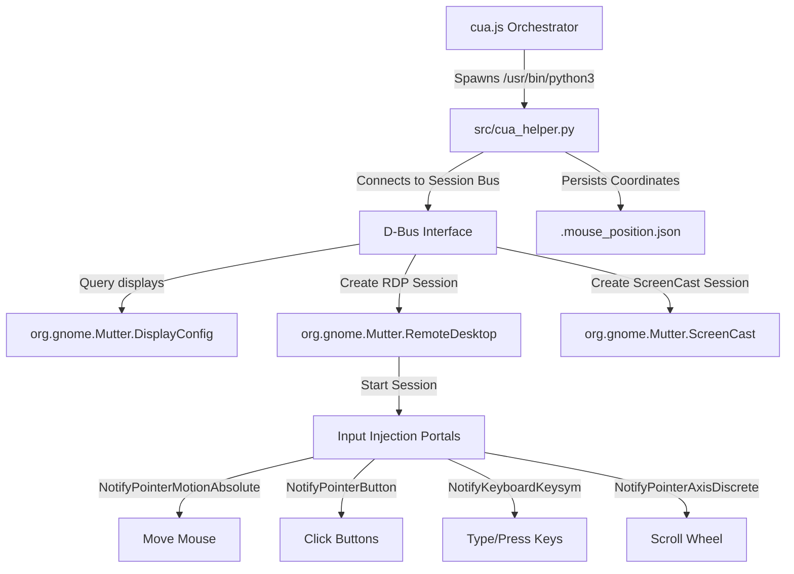

<p align="center">
  
</p>

<h1 align="center">Swades Agent</h1>

<p align="center">
  Autonomous AI software engineering agent for your terminal.<br/>
  ReAct loop · OpenAI-compatible · Token streaming · Self-correcting · 24/7 Director mode
</p>

<p align="center">
  <a href="https://www.npmjs.com/package/@xerv/swades-agent"></a>
  <a href="https://open-vsx.org/extension/xerv/swades-agent"></a>
  <a href="LICENSE"></a>
</p>

<p align="center">
  <a href="#install">Install</a> ·
  <a href="#how-to-use">How to Use</a> ·
  <a href="#tools">Tools</a> ·
  <a href="#architecture">Architecture</a> ·
  <a href="#safety--guardrails">Safety</a>
</p>

---

## What is Swades Agent?

Swades Agent is an open-source, terminal-native autonomous AI coding agent built on the **ReAct (Reasoning + Acting)** loop pattern. You give it a coding task in plain text. It reads your codebase, edits files with surgical precision, runs shell commands, searches code, and iterates until the task is done — all without leaving your terminal.

It works with any **OpenAI-compatible API** (OpenAI, OpenRouter, Groq, Ollama, etc.), streams tokens to the terminal in real-time as the model thinks, and runs automatic syntax validation on every file it writes.

No GUI. No cloud lock-in. No build step. **Zero configuration choices at runtime — just describe your task and go.**

<details>
<summary><b>📊 Codebase Line Count Breakdown</b></summary>

| File | Language | Lines of Code | Description |
| :--- | :--- | :---: | :--- |
| [`src/cua.js`](src/cua.js) | JavaScript | 596 | CUA desktop orchestrator |
| [`src/simulator.js`](src/simulator.js) | JavaScript | 505 | Sandbox Simulation Engine |
| [`src/tools.js`](src/tools.js) | JavaScript | 600+ | File operations, syntax checking, stack detection, shell tools |
| [`src/agent.js`](src/agent.js) | JavaScript | 290+ | Core ReAct agentic loop + loop detection |
| [`src/orchestrator.js`](src/orchestrator.js) | JavaScript | 254 | Parent orchestrator, parallel subagents, worktree manager |
| [`src/subagent.js`](src/subagent.js) | JavaScript | 180+ | Subagent lifecycle and setup |
| [`src/llm.js`](src/llm.js) | JavaScript | 190+ | OpenAI API wrapper, streaming, multi-model fallback cascade |
| [`src/prompts.js`](src/prompts.js) | JavaScript | 170+ | System prompts & function-calling schemas |
| [`src/director.js`](src/director.js) | JavaScript | 110 | Autonomous Director loop supervisor |
| [`src/index.js`](src/index.js) | JavaScript | 170+ | CLI entry point and argument parser |
| [`src/memory.js`](src/memory.js) | JavaScript | 90+ | Session persistence & context injection |
| [`src/cleanup.js`](src/cleanup.js) | JavaScript | 100+ | Cache dir management & legacy migration |
| [`src/cua_helper.py`](src/cua_helper.py) | Python | 768 | GNOME Mutter RDP/ScreenCast Wayland automation helper |
| [`src/take_portal_screenshot.py`](src/take_portal_screenshot.py) | Python | 111 | Pipewire video stream frame grabber |

</details>

---

## Key Capabilities

- **ReAct agentic loop** — Thought → Tool Call → Observation → repeat until task is solved
- **Zero-choice UX** — just type your task. Mode (normal / autonomous / CUA) is auto-detected by AI
- **Real-time token streaming** — see the model's reasoning and tool arguments token-by-token as they arrive
- **Multi-model fallback cascade** — automatically retries on rate limits (429), payment errors (402), and service outages with configurable fallback models
- **Intelligent loop detection** — catches repetitive tool calls, blocks infinite index file reads, detects stagnation
- **Stack-aware code generation** — auto-detects project language/framework (JS, Python, Rust, Go, Java) and generates matching code
- **Repository cleanliness** — all agent metadata stored in `~/.cache/swades/`, never in your project root
- **Partial file patching** — edits only the exact block that needs changing, not the entire file (saves tokens, preserves indentation)
- **Automatic codebase indexing** — maps your repo structure (imports, exports, classes, functions) before starting
- **Built-in syntax checker** — validates bracket matching, indentation consistency, `node --check` for JS, `py_compile` for Python
- **24/7 Director mode** — a second "Director" model instance reviews progress after each run and writes the next subtask on behalf of the user
- **Session memory** — persists a summary of each run and injects recent context into the next session
- **Defensive coding** — all errors are logged, never silently swallowed

---

## Install

### Option 1: Install from npm (Recommended for CLI usage)

```bash
npm install -g @xerv/swades-agent
```

That's it. Now you can run it from **any directory**:

```bash
# Navigate to your project
cd ~/my-project

# Set up your API key (first time only)
export API_KEY=sk-or-v1-your-key-here

# Run it
swades-agent "Add input validation to the login form"
```

Or use a `.env` file in your project root:

```bash
# Create .env in your project
echo "API_KEY=sk-or-v1-your-key-here" > .env
echo "BASE_URL=https://openrouter.ai/api/v1" >> .env
echo "MODEL=openrouter/free" >> .env

# Run it
swades-agent "Fix the failing tests in src/auth.js"
```

> **Note:** When installed globally via npm, Swades Agent automatically uses your **current working directory** as the workspace. Just `cd` into your project and run.

---

### Option 2: Install from Open VSX / VS Code Marketplace

Search for **"Swades Agent"** by publisher **xerv** in your editor's extension marketplace:

- **VS Code / Cursor / Windsurf**: Open Extensions (`Ctrl+Shift+X`) → Search "Swades Agent" → Install
- **Open VSX compatible editors**: Search at [open-vsx.org/extension/xerv/swades-agent](https://open-vsx.org/extension/xerv/swades-agent)

After installing:

1. Open your project workspace in the editor
2. Press `Ctrl+Shift+P` (or `Cmd+Shift+P` on Mac) to open the Command Palette
3. Type **"Swades Agent: Run Task"** and press Enter
4. Type your task → Done. Mode is auto-detected.

> **Note:** The extension runs Swades Agent in an integrated terminal within your editor. You still need an API key — create a `.env` file in your project root with your `API_KEY`.

---

### Option 3: Clone from GitHub (for development / contribution)

```bash
git clone https://github.com/Electroiscoding/Swades-Agent.git
cd Swades-Agent
npm install
cp .env.example .env
# Edit .env with your API key
npm start
```

---

## How to Use

### The Simple Way (zero decisions)

Just describe what you want. Swades figures out the rest.

**Interactive:**
```bash
swades-agent
# or: npm start (if cloned from GitHub)
# or: Ctrl+Shift+P → "Swades Agent: Run Task" (if using VS Code extension)

🚀 Swades Agent

  Just describe what you want done. Mode is auto-detected.

  What do you need? → Add input validation to the login form and run tests
  🤖 Auto-detecting optimal execution mode...
   → Autonomous mode (Director-supervised)
```

**One-liner:**
```bash
swades-agent "Write a hello world script in Python"
swades-agent "Refactor the entire codebase to TypeScript and verify it compiles"
swades-agent "Go to Chrome and search for cat pictures"
```

Swades auto-detects whether your task needs:
- **Normal mode** — simple single-run tasks (explanations, quick edits, commands)
- **Autonomous mode** — complex multi-step tasks (features, refactors, debugging)
- **CUA mode** — desktop GUI automation (clicking, typing, screenshots)

### Power-User Flags (optional overrides)

If you want to force a specific mode, use CLI flags:

```bash
swades-agent "Build a REST API" --autonomous    # Force Director-supervised mode
swades-agent "Open Firefox" --cua               # Force desktop automation mode
swades-agent "Run git status" --normal          # Force single-run mode
swades-agent "Refactor tests" --subagents       # Force parallel subagent decomposition
swades-agent "Describe this mockup" --image design.png  # Attach an image
```

### Image & Multimodal Support

```bash
swades-agent "Implement this UI design" --image mockup.png
swades-agent "What's in this screenshot?" -i https://example.com/screenshot.png
```

---

## Environment Configuration

Create a `.env` file in your project root:

```env
API_KEY=sk-or-v1-your-key-here
BASE_URL=https://openrouter.ai/api/v1
MODEL=openrouter/free

# Optional: Fallback models for automatic failover on rate limits
FALLBACK_MODELS=nousresearch/deephermes-3-llama-3-8b-preview:free,deepseek/deepseek-chat-v3-0324:free
```

**All supported environment variables:**

| Variable | Required | Default | Description |
|---|---|---|---|
| `API_KEY` | Yes | — | Your LLM provider API key |
| `BASE_URL` | No | `https://openrouter.ai/api/v1` | Provider base URL (change for OpenAI, Groq, Ollama, etc.) |
| `MODEL` | No | `openrouter/free` | Model identifier string |
| `FALLBACK_MODELS` | No | — | Comma-separated fallback model list for auto-failover on 429/402/403 |
| `MAX_STEPS` | No | `∞` | Max tool-call iterations per agent run |
| `MAX_OUTPUT_LENGTH` | No | `10000` | Character cap on tool output returned to the model |
| `WORKDIR` | No | `process.cwd()` | Absolute or relative path the agent operates on |

**Using a different provider:**

```env
# OpenAI
API_KEY=sk-...
BASE_URL=https://api.openai.com/v1
MODEL=gpt-4o

# Groq
API_KEY=gsk_...
BASE_URL=https://api.groq.com/openai/v1
MODEL=llama-3.3-70b-versatile

# Local Ollama
API_KEY=ollama
BASE_URL=http://localhost:11434/v1
MODEL=qwen2.5-coder:7b
```

---

## Tools

The agent has access to 9 tools it can call during a run:

| Tool | Arguments | Description |
|---|---|---|
| `index_codebase` | _(none)_ | Scans workspace, generates codebase index with file paths, sizes, imports, exports, classes, functions |
| `read_file` | `path`, `start_line?`, `end_line?` | Returns file contents with line numbers. Supports partial reads by line range. |
| `write_file` | `path`, `content` | Writes a complete new file. Runs syntax + indentation checks on save. |
| `patch_file` | `path`, `target`, `replacement` | Replaces a unique block within an existing file. Space-sensitive. |
| `list_dir` | `path`, `recursive?` | Lists directory tree. Skips `node_modules`, `.git`, and the agent's own folder. |
| `grep_search` | `pattern`, `path`, `include?` | Runs `grep -rnI` across the workspace. |
| `run_command` | `command`, `cwd?` | Executes a shell command with 30s timeout. |
| `peek_terminal` | `action?` | Check background process output or terminate it. |
| `extend_deadline` | `additional_seconds`, `reason` | Extend the task time limit if more time is needed. |

**Automatic validation on every write:**

Both `write_file` and `patch_file` run these checks immediately after writing and return the results to the model so it can self-correct:

- Bracket matching: detects unclosed `{`, `(`, `[` and mismatched pairs
- Indentation consistency: flags mixed tabs + spaces; flags sudden indentation jumps
- JS/MJS/CJS: runs `node --check <file>` for compiler-level syntax errors
- Python: runs `python3 -m py_compile` for syntax validation
- JSON: runs `JSON.parse()` on the written content

---

## CUA (Computer Use Agent) Mode & Wayland Native Support

Swades Agent features a graphical **Computer Use Agent (CUA)** mode, empowering the AI model to interact directly with your Linux desktop. Unlike most automation systems that fail under Wayland due to legacy X11 emulation tools (`xdotool`, `pyautogui`), Swades Agent supports native GUI automation on modern **GNOME Wayland** configurations.


https://github.com/user-attachments/assets/d0541757-2ea1-4259-a260-75e8febef557


---

### Detailed Wayland Native Architecture
Under Wayland, the graphical environment enforces security isolation, preventing direct hardware event simulation or global pointer querying. Swades Agent bypasses this restriction by using GNOME's native Mutter remote desktop infrastructure:


```mermaid
graph TD
    A["cua.js Orchestrator"] -->|Spawns /usr/bin/python3| B["src/cua_helper.py"]
    B -->|Connects to Session Bus| C["D-Bus Interface"]
    C -->|Query displays| D["org.gnome.Mutter.DisplayConfig"]
    C -->|Create RDP Session| E["org.gnome.Mutter.RemoteDesktop"]
    C -->|Create ScreenCast Session| F["org.gnome.Mutter.ScreenCast"]
    E -->|Start Session| G["Input Injection Portals"]
    G -->|NotifyPointerMotionAbsolute| H["Move Mouse"]
    G -->|NotifyPointerButton| I["Click Buttons"]
    G -->|NotifyKeyboardKeysym| J["Type/Press Keys"]
    G -->|NotifyPointerAxisDiscrete| K["Scroll Wheel"]
    B -->|Persists Coordinates| L[".mouse_position.json"]
```

#### Key Architecture Components:
1. **Mutter D-Bus Session Linking**:
   - The helper script connects to the session bus via `gi.repository.Gio` and `GLib`.
   - It queries `org.gnome.Mutter.DisplayConfig` to find the connector name of the primary monitor dynamically (e.g. `eDP-1`, `HDMI-1`).
   - It initializes a RemoteDesktop session to get a unique `SessionId`.
   - It initializes a ScreenCast session, linking it to the RemoteDesktop session via the `remote-desktop-session-id` property.
   - It starts the ScreenCast recording on the primary monitor connector, which generates a PipeWire stream path.
   - It starts the RemoteDesktop session. With both sessions active, absolute pointer coordinates are injected relative to the screen dimensions.
2. **State-Based Mouse Tracking**:
   - Because Wayland blocks querying the active mouse coordinates directly, Swades Agent maintains an internal coordinate tracking state file in `.mouse_position.json`.
   - Every move, click, or drag updates this file.
   - When a screenshot is taken (using standard portal screencasting), `cua_helper.py` reads the last stored coordinate from `.mouse_position.json` to draw the red target crosshair overlay at the correct place.
3. **Graceful Fallback**:
   - If the script is run on an X11-based session, it automatically falls back to standard `xdotool` and `pyautogui` logic, making the agent compatible with both Wayland and X11 out-of-the-box.

---

### Step-by-Step Installation Prerequisites
To use CUA mode under a Wayland session, follow these steps to set up your environment:

#### Step 1: Ensure system python has GObject bindings
Since Node.js spawns the helper script using the system `/usr/bin/python3`, you must ensure that python has access to the GObject Introspection library.
Run the following command to install the required package on Debian/Ubuntu-based systems:
```bash
sudo apt update
sudo apt install python3-gi python3-gi-cairo
```
On Fedora/RHEL:
```bash
sudo dnf install python3-gobject
```
On Arch Linux:
```bash
sudo pacman -S python-gobject
```

#### Step 2: Enable Remote Desktop Sharing in GNOME
Make sure your user session is authorized to run Mutter Remote Desktop sessions. In GNOME, navigate to:
`Settings -> Sharing -> Remote Desktop` and ensure it is turned on.
*(Note: Since the agent connects locally via the active user D-Bus session, you do not need to configure any network/port forwarding rules).*

---

### How to Run CUA Mode

CUA mode is auto-detected when your task mentions GUI, desktop, browser, or app interactions. Or force it:

```bash
swades-agent "go to notepad and type hello world and save it"
# Auto-detects → CUA mode

swades-agent "open Chrome and search for Node.js docs" --cua
# Forced → CUA mode
```

---

### Advanced Click-Loop Safety Guardrail
To safeguard against models getting stuck in infinite loops (for example, clicking the same spot repeatedly on a frozen or unresponsive GUI element), Swades Agent implements a strict **repeat click prevention check** directly inside the orchestrator ([cua.js](src/cua.js)):

1. **Bounding Box Proximity**: Clicks are tracked by their coordinates. Any click that falls within a **25px horizontal and 15px vertical bounding box** of a previous click is classified as being in the "same area".
2. **Consecutive Block**: The model is forbidden from clicking the same area consecutively (back-to-back). If it attempts to do so:
   - The click is blocked.
   - The terminal displays a red warning: `❌ Declined: Cannot click in the same place consecutively (back-to-back).`
   - An error message is returned to the model as tool output: `Declined: You cannot click the same area consecutively...`
3. **Overall Frequency Limit**: The model is forbidden from clicking the same area more than **2 times overall** throughout the entire task execution. If a third click is attempted:
   - The click is blocked.
   - The terminal displays a red warning: `❌ Declined: Clicked this place more than twice overall.`
   - An error message is returned to the model as tool output: `Declined: You have already clicked this same area 2 times...`

This feedback forces the model to self-correct, try alternative UI pathways, or scroll/navigate elsewhere, breaking infinite loops and saving token costs.

---

## Architecture

```
src/
  index.js      CLI entry point — zero-choice UX, auto-detects mode, dispatches to agent/director/CUA
  agent.js      ReAct loop — loop detection, stack detection, streaming LLM call, tool dispatch
  director.js   Director loop — runs worker across cycles, reviews history, writes next subtask prompt
  llm.js        OpenAI SDK wrapper — streaming, multi-model fallback cascade on 429/402/403
  tools.js      9 tool implementations + heuristic syntax checker + codebase indexer + stack detection
  prompts.js    System prompt + anti-loop rules + stack-aware guidance + tool schemas
  memory.js     Session persistence in ~/.cache/swades/ (never in project root)
  cleanup.js    Cache directory management, legacy file migration
  subagent.js   Parallel subagent lifecycle with /tmp worktrees (never in project root)
  orchestrator.js  Task complexity evaluation, subagent spawning, diff merging
  simulator.js  Multi-scenario sandbox simulation engine
```

**Single-run message flow:**
```
index.js → migrate legacy files → index_codebase() → agent.js loop:
  [system + memory + stack + task] → LLM (streaming SSE)
    → text delta    → printed live to terminal
    → tool_call delta → loop check → executeTool() → observation → appended to messages
  repeat until LLM returns no tool calls → print final answer → exit
```

**24/7 autonomous message flow:**
```
director.js → cycle 1..N:
  runAgent(messages)         ← worker resolves a subtask
  callLLM(directorMessages)  ← director reviews history, writes next prompt
  messages.push(nextPrompt)  ← appended as user turn, fed into next cycle
  repeat until director outputs "STATUS: COMPLETE"
```

---

## Safety & Guardrails

- **Workspace isolation & self-hiding** — when installed as a subdirectory of the target project, the agent filters out its own folder from `list_dir` and `grep_search`. The model cannot see, read, or modify its own source files.
- **Repository cleanliness** — all agent metadata (index, memory, terminal logs) stored in `~/.cache/swades/`, worktrees in `/tmp/`. Your project root stays 100% clean.
- **Loop detection** — blocks repeated identical tool calls, prevents index file re-reading, detects stagnation after 4 steps without file modifications.
- **Multi-model fallback** — automatically retries on 429/402/403/503 with configurable fallback models instead of crashing.
- **Dangerous command blocking** — shell commands matching `rm -rf`, `sudo`, `kill`, `dd if=`, `chmod 777`, `:(){`, and others pause execution and require an explicit `y` typed in the terminal before running.
- **Step cap** — by default, the worker agent has NO step limit (`Infinity` steps), enabling execution of long-running or highly complex developer tasks. You can optionally cap it by setting `MAX_STEPS` in `.env`.
- **Director cycle cap** — by default, the Director loop has NO cycle limit (`Infinity` cycles) to iteratively direct the worker agent until the overall goal is fully complete.
- **Context Condensation** — uses OpenRouter's `context-compression` plugin to dynamically condense prompt histories when they approach context limits, preventing token overflows during long executions.
- **Timeout** — `run_command` automatically times out after 30 seconds.
- **Workspace scoping** — all file paths passed to tools are resolved relative to `WORKDIR`. The agent cannot access paths outside of it.
- **Defensive coding** — all internal errors are logged with context, never silently swallowed.

---

## Session Memory

After each completed run, the agent appends a session record to `~/.cache/swades/<project>/agent_memory.json`:

```json
{
  "timestamp": "2024-01-15T10:30:00Z",
  "task": "Add input validation to the login form",
  "summary": "Added email format check and password length validation in src/auth.js. Updated tests.",
  "toolsUsed": ["read_file", "patch_file", "run_command"]
}
```

On the next run, the three most recent sessions are injected into the system prompt, giving the agent continuity between invocations without needing a long-running server.

---

## 🛠️ v3.0 Advanced Features: Subagents & Simulation (Step-by-Step)

Swades Agent v3.0 introduces a robust, enterprise-grade workflow for handling complex engineering tasks cleanly and safely. Here is how it works under the hood, step-by-step:

### Step 1: Automated Complexity Classification
When you run a coding task, the orchestrator automatically evaluates it:
* **LOW Complexity**: Simple edits, documentation tweaks, or single-file fixes. The worker agent runs directly in your workspace. **Zero overhead, no subagents spawned.**
* **HIGH Complexity**: Multi-file refactors, new feature implementations, or large structural updates. The orchestrator triggers the parallel subagent and simulation pipelines.

### Step 2: Isolated Parallel Subtask Spawning
* The parent orchestrator breaks down the main task into 2 to 5 concrete subtasks.
* It uses **Git Worktrees** in `/tmp/swades_worktrees/` to spin up isolated workspace directories.
* Subagents run concurrently (up to 5 parallel processes, managed by a semaphore queue).
* Since each subagent writes code in its own worktree, there is **zero risk of file corruption or dirty edits** during development.

### Step 3: Git Rebase Alignment & Diff Merging
* Once subagents complete their tasks, their changes are captured as code diff bundles.
* The parent orchestrator merges the non-conflicting diffs back into your main workspace.
* **Conflict Resolution**: If overlapping modifications cause git merge conflicts, a specialized **Merge-Resolution Subagent** is dynamically spawned to safely resolve the overlapping lines.
* All temporary worktree sandboxes are pruned and deleted immediately.

### Step 4: Multi-Scenario Sandbox Simulation
* Before committing simulated changes to real-life files, the Simulation Engine generates **2 to 4 alternative implementation scenarios** representing different architectural strategies.
* Each scenario is run inside its own transient sandbox directory.
* The engine compiles the code in each sandbox (verifying JS syntax with `node --check` and project builds with `package.json` scripts) and runs automated test suites.
* The LLM reviews the results and selects the single **best-performing winner scenario** (based on diff cleanliness and compilation/test success).

### Step 5: The Promotion Pipeline (Sandbox to Real Life)
Once a scenario is chosen, it goes through three safety gates:
1. **Workspace Git Rebase Check**: Verifies the main repository hasn't moved forward. If it has, it performs an automatic non-destructive git rebase.
2. **Shadow Verification**: Applies the winning diff to a clean temporary verification worktree and executes builds to guarantee 100% correctness.
3. **Live Workspace Mutation**: Applies the verified diff to your active workspace, creating clean, compilation-passing modifications.
4. **Telemetry Delta Report**: Generates simulation report showcasing simulated expectations vs. final verified real-life outcome.

---

## What's New in v2.0

* **Zero-Choice UX (v2.0)** — Eliminated user choice paralysis. Interactive mode asks only for the task; mode is auto-detected by AI. No more "choose mode" prompts.
* **Multi-Model Fallback Cascade (v2.0)** — Automatic failover on 429 Rate Limit, 402 Payment Required, 403 Forbidden, and 503 Service Unavailable. Configure `FALLBACK_MODELS` in `.env`.
* **Intelligent Loop Detection (v2.0)** — `LoopDetector` class catches repeated identical tool calls (3x threshold), blocks re-reading `.agent_index.json`, and detects stagnation (4+ steps without file modifications).
* **Repository Cleanliness (v2.0)** — All metadata (`.agent_index.json`, `.agent_memory.json`, terminal logs) moved to `~/.cache/swades/`. Worktrees moved to `/tmp/swades_worktrees/`. Your project root stays 100% clean.
* **Stack-Aware Code Generation (v2.0)** — Auto-detects project stack from `package.json`, `requirements.txt`, `Cargo.toml`, `go.mod`, `build.gradle`, etc. Injects language/runtime/framework context into the system prompt. Prevents cross-language subprocess spawns.
* **Python Syntax Validation (v2.0)** — `py_compile` check on every `.py` file write, in addition to existing `node --check` for JS.
* **Defensive Coding (v2.0)** — All bare `catch {}` blocks replaced with structured error logging. No more silently swallowed exceptions.
* **Anti-Loop Prompt Rules (v2.0)** — System prompt now includes explicit anti-loop and stack-awareness rules to prevent the agent from getting trapped.

### Previous Releases

* **Self-Healing Linter Auto-Fix (v3.1)** — Automatically repairs unclosed brackets, mixed indentation, and invalid JSON formatting on save operations.
* **Conditional Indentation Validation (v3.1)** — Bypasses indentation alerts for non-indentation-sensitive files (JS, CSS, HTML, Markdown), restricting strict indentation rules to Python and YAML.
* **Persistent Shell Layer & Detached Timeout (v3.1)** — Spawns shell processes asynchronously. Leaves processes running in the background when the 30-second wait limit is exceeded rather than sending SIGKILL.
* **`peek_terminal` Tool (v3.1)** — Enables checking background process output logs and execution status dynamically, with support for command termination.
* **Dynamic Task countdown & Urgency Pressure (v3.1)** — Estimates task duration at startup, prints terminal progress bar meters, and injects elapsed/remaining time prompts to guide the agent under time constraints.
* **Subagent Orchestration System (v3.0)** — task decomposition, parallel execution in isolated Git worktrees, and automated conflict resolution.
* **Sandbox Simulation Engine (v3.0)** — multi-scenario sandbox runs, LLM verdict selection, and a 3-step promotion pipeline (Rebase → Shadow Verify → Live Apply).
* **Infinite Step / Cycle Budgets (v3.0)** — removed hard step caps. The agent can run indefinitely to solve complex objectives.
* **OpenRouter Context Compression (v3.0)** — integration of the OpenRouter `context-compression` plugin to prevent token overflows on unbounded histories.
* **Native Wayland GUI Support (v2.1)** — native desktop input simulation (clicking, typing, scrolling, dragging) via GNOME Mutter RemoteDesktop and ScreenCast DBus APIs. No X11 dependencies.
* **Anti-Loop Click Protection (v2.1)** — automatic consecutive and overall frequency limits on spatial clicks (using a 25px x 15px bounding box) to prevent looping click sequences.
* **JSON System Instructions (v2.1)** — system prompt structured as a clean, high-compliance JSON schema to enforce reasoning/ReAct rules.
* **24/7 Director Loop (v2.0)** — autonomous multi-cycle execution with a supervising Director model. Pass `--autonomous` to any task.
* **Codebase Indexing (v2.0)** — automatic `index_codebase` run at startup generates codebase index with the full repository structure so the model starts with deep context.
* **Partial File Patching (v2.0)** — `patch_file` tool for surgical block-level edits. Preserves exact indentation. Saves significant tokens vs. full-file rewrites.
* **Static Syntax Guardrails (v2.0)** — automatic bracket matching, indentation checks, `node --check`, and JSON parse validation on every file save, with errors returned to the model for self-correction.
* **Real-time Token Streaming (v2.0)** — LLM reasoning, tool names, and arguments stream to the terminal token-by-token using OpenAI SDK SSE.
* **Session Memory (v2.0)** — cross-run context via session memory.
* **Referer attribution (v2.0)** — all API calls include `HTTP-Referer: https://xerv.netlify.app/swades.html` for OpenRouter analytics tracking.
